[toc]

## 前言
随科技的发展，技术的变革，互联网飞速发展的信息时代，`Web`开发技术的更新迭代也在加快。从最初的`HTML`静态页面到混合开发再到`MVC`时代，从`MVC`时代到`Ajax`的前后端协作开发再到今天的前后端分离开发都是层出不穷的新技术。

`Vue.js` 是前后端分离开发的技术之一，`Vue`是一套构建用户界面的渐进式框架，它是以数据驱动视图和组件化的思想构建的，采用自底向上增量开发的设计，其核心库只关注视图层，同时`Vue`完全有能力驱动采用单文件组件和 `Vue` 生态系统支持的库开发的复杂单页应用。`Vue` 从2013年的实验阶段到2015的`V1.0`版本再到2016年的`V2.0`版本再到最新的`V3.0`版本，时至今日，已成为世界上三大主流前端框架之一，`github` 拥有的`Star`领先于 `React` 和 `Angular`。`Vue.js`有完善的中文文档、中文社区、易学易上手，在国内是主流技术之一。为了能够让刚进入前端的爱好者更快的掌握`Vue3`的技术，笔者将以“基础篇”和“进队篇”两个部分内容结合企业中是常见的管理后台进行`Vue3`技术的实战演练，通过管理系统的业务模块结合`Vue`技术讲解企业内部的开发过程以及项目文件的解读，读者将通过本书的项目熟悉掌握运用`Vue.js`技术的快速应用，并可完全自主搭建后台管理系统。

## 文章内容
本书共13章，各章简介如下。

**第1章“项目启动”**：讲述了新项目启动起时会拿到哪些和项目有关的资料，如项目原型和界面`UI`，通过这些资料可以清楚了解项目的业务逻辑和具体要开发的功能以及要呈现给用户的界面效果和交互效果。此外，还讨论了项目开发过程的原型评审、测试用例评审、`UI`评审等事项，这些都是公司内部开发项目的常规流程。

**第2章“项目构建”**：介绍了如何通过脚手架工具的命令和可视化两种方式快速的构建项目，以及团队协作的代码仓库管理和项目开发过程的分支管理。

**第3章“初始项目”**：讲解了`Vue`项目的运行入口和项目的文件结构分布，并且在开发项目前通过初始化项目依赖第三方`UI`包、清除浏览器默认样式等动作提高工作开发效率。

**第4章“`Vue3`的变化”**：这章主要是介绍了`Vue3`的一些新的`API`特性、`Vue2`和`Vue3`生命周期的区别和新的声明对象语法，通过这章的了解对后续的开发更为顺畅。

**第5章“登录注册需求”**：进述了项目其中一个模块的业务开发，通过该模块的需求一步步了解`Element Plus UI`组件的使用方式和`Vue`指令的用法，并且在开发过程中一步步了解前端如何与后端对接数据，以什么方式对接，并了解`API`接口文档的使用、`API`接口联调、测试工程师的测试用例理解等。此外，还介绍了如何根据UI实现交互动作以及根据项目原型实现业务需求。

**第6章“管理后台搭建”**：介绍了管理后台整体的结构由哪几部分组件，通过拆解的几个部分组合成管理后台，并有也介绍了如何通过“静态路由”实现菜单的渲染以及菜单图标的开发方式。

**第7章“`VUEX`状态管理”**：讲述了`VUEX`在`Vue`项目的具体作用，如何通过`VUEX`实现项目全局的数据应用，并且通过`VUEX`实现管理后台菜单的“展开/收起”效果。

**第8章“路由守卫”**：介绍了路由守卫在管理后台起到了什么作用，以及在开发路由守卫过程中遇到的各种逻辑和问题解决方式。

**第9章“信息管理模块”**：讲述了独立模块结合第三方`UI`的开发过程，同时结合项目原型和项目`UI`，以及更多的`API`接口联调，可更深一步熟悉业务的整体开发过程。

第10章“组件化”：介绍了组件二次封装的核心和组件封装的整体过程，以及为什么要二次封装组件和封装的组件能为项目带来什么。

**第11章“系统配置”**：讲述了如何通过“角色”桥接“用户”达到用户的权限分配。并且通过二次封装的组件实操性的完成“菜单管理”、“角色管理”、“用户管理”三个模块的开发，体验传统开发方式和组件开发方式的区别。

**第12章“权限功能”**：第12章“权限功能”介绍了如何通过读取用户的权限以“动态路由”的方式渲染管理后台的菜单以及“自定义指令”现实页面元素级的控制。

**第13章“项目部署”**：讲述了项目打包的优化，如何使项目体积变小，提高项目加载速度，并且也简单介绍如何部署到服务器访问开发完成的项目。

**项目源码及课件**
文章学习思维导航，务必了解哦：https://www.processon.com/view/link/61b215f65653bb4461f8d598

“手把手撸码前端”官网下载和本书相关的所有课件资料，包括所有章节的文档、`UI`稿件、原型图以及项目源码等，官网地址：http://www.web-jshtml.cn。

了解更多课程视频，可关注`UP`主：https://space.bilibili.com/431551452。

学习思维导图：https://www.processon.com/view/link/61b215f65653bb4461f8d598；

## 第1章 项目启动
项目启动，意味着新项目的开始或是现有项目下一个阶段的变化。项目启动阶段所准备的材料是否充足、目标是否明确、制定的计划是否合理等因素往往决定了项目的质量和成败，无论开发什么样的项目都要遵从严格、成熟的开发过程才会有高质量的项目产出。

一般情况下，项目会有：项目需求、`UI`设计、代码编程、代码审核、项目测试、项目发布、复盘等阶段。项目的每个阶段要达成的目标、制定的计划、人员之间的沟通都会影响到项目的开发进展，所以在项目开发过程中要确保所有人的信息是“对称”的，清楚的知道大家在不同阶段的进展才能更好更快更有质量的使项目完整落地，否则都会影响项目的最终结果。

### 1.1 项目原型
原型是经过“项目需求”收集后由产品经理将需求点“具象化”出来的可视化演示系统，起到展示和分析的作用，也称为“项目原型”。项目原型可以是静态的`HTML`页面，也可以是`UI`稿件的插图，在国内用的比较多的原型工具有`Axure`、墨刀等。

本书所介绍的“管理后台”项目原型文件可查看课件的“`Vue3.0+ElemenPlus`企业级管理后台原型”或是访问作者个人网站查看，也可以访问以下网址：https://lanhuapp.com/url/OxnLy，如图1-1所示。

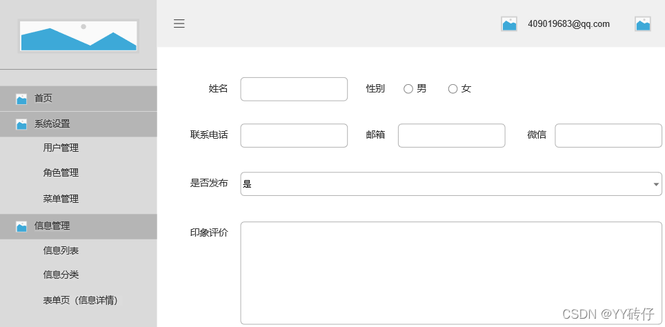

原型除了演示项目外，也具备了业务逻辑分析、业务交互的呈现以及非常重要的需求文档（`PRD`）。需求文档和项目原型是不可分割的，原型是呈现项目所使用的元素以及交互是什么，需求文档则是描述模块元素和业务之间的逻辑关系是什么，开发人员通过需求文档的说明便能很清楚的知道原型所呈现的元素具体会有什么样的逻辑和交互以及大部分的业务需求。

### 1.2 项目`UI`
项目`UI`是建立在项目原型的基础上由`UI`设计师设计出来的视觉规范。`UI`全称是`User Interface`，即：用户界面。`UI`设计也称为用户界面设计，是指`UI`设计师根据“项目原型”和“需求文档”两者呈现的元素和业务逻辑关系设计的人机交互、操作逻辑、界面美观等视觉效果。如：界面设计、结构设计、颜色规范、按钮效果、图标元素等视觉，本书所介绍的“管理后台”项目`UI`文件可查看课件的“`UI`稿件”或访问作者个人网站查看，如图1-2所示。

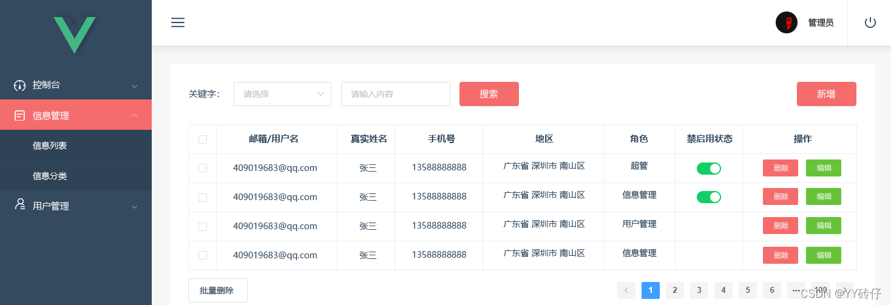

### 1.3 项目开发流程
项目从启动到落地的过程会经历很多部门的人员参与，参与项目的所有人是“环环相扣”的，脱离任何一个环节都会影响到项目的开发进度。无论项目的大小基本上都会有一个流程，下面来了解一下项目的开发过程中可能会涉及到的部门会有哪些，如图1-3所示。

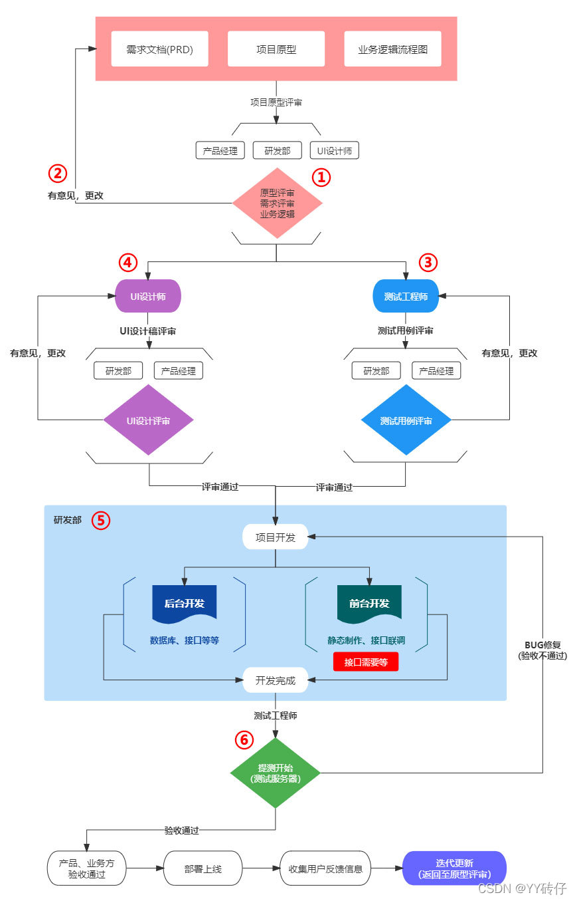

原型评审
项目立项后产品经理会规划出项目的原型、需求文档、业务逻辑、流程、交互等各方面的文件，接着就是原型的评审，一般都会有产品经理、研发部、UI设计师等人参与，如图1-3的①标记。产品经理会讲解项目原型的业务逻辑、流程、交互等，研发部人员需要根据产品经理讲述的内容进行业务逻辑、程序逻辑、数据库、服务器等问题考虑。会议过程中肯定会有一些问题，如果遇到有疑问的位置可以随时提出，也可以先记录下来，等产品经理发问时便可提出问题或是建议等。评审过程中有疑问就问，或是有更好的方案都可以提出，只有把东西弄明白了才能更好的去开发业务逻辑。
当然了，一轮评审会议下来肯定是会有问题的，毕竟一个人所思考的事情还是有一定局限性，很多人一起想就不一样了，有不合理的地方就要修改。②标记处的“有意见”，就是在第一轮的原型评审后大家提出的问题，产品经理就要对需求做修改，改完后再进行第二轮的评审，一直反复的进行这个环节，一般情况在第二轮或第三轮就可以把需求理清楚，最终也确定出第一期要开发哪些功能，便会进入到下一个环节，也就是③、④、⑤标记处。
测试工程师、UI设计师、研发部
原型评审通过后便进入项目的初期开发阶段，也就是③、④、⑤标记处的同事会同步进行各自的开发任务。
● 测试工程师 ③：负责测试用例的编写。除了测试用例外也需要进行测试计划、冒烟测试、测试界面、接口测试、自动化测试等工作的准备；测试用例是写给研发人员看的，会很详情的体现出操作过程中需要程序去做些什么事情，研发人员根据测试用例的步骤以及业务逻辑来开发便可。测试用例也是需要评审的，也就是评审整体过程的逻辑、交互等是否合理，结果和“原型评审”一样，如果有意见可以提出，会议结束就修改，改完后再次评审直至通过为止。
● UI设计师 ④：负责产品的界面UI设计，也是直接面向于用户的。UI基本上是评审色调、元素、交互、操作体验等各方面，评审过程中同样也是可以提出问题和建议，之后也是修改，修改完成后再进行评审直至通过为止。
● 研发部 ⑤：一般有“前端”、“后端”等同事，研发部这边会自己在部门内部讨论技术选型，例如前端确定用Vue.js来开发还是其他的技术，后端是采用Java还是go还是其他语言以及数据库、服务器等，确定了技术选型后，前端、后端就要开始搭建基础的东西。

### 开发阶段
开发阶段也差不多有了“测试用例”、“接口”等资料，前端可以跟着“测试用例”来处理逻辑的事，同时和后端对接接口的联调，除了这些之外还需要多看“产品原型”，根据原型的业务逻辑、交互等开发业务需求，同时也要看UI效果图，也是确定界面元素及交互是否和UI效果图一致。
前端和后端的开发工作是紧密的，缺了谁都无法顺利完成项目的开发，所以沟通很重要。当项目的需求都开发完了，就是将项目部署到“测试服务器”，服务器一般都会由“运维”的同事提前准备好，前端和后端只需要将项目打包部署到服务器便可通过域名或IP访问项目。
项目测试
项目测试是测试工程师对开发好的项目进行验收（标记⑥），验收需求、UI效果、业务逻辑等是否产生BUG。因为做为研发人员在开发业务需求时，一般都是顺着业务逻辑一步步的走，虽然在开发的时没问题，但让用户使用时他们并不会按业务逻辑来走，他们也不知道是什么逻辑，那么“测试工程师”也相当于用户体验已完成开发的项目，有可能有意想不到的问题出现，这些问题就是我们常说的BUG。
项目测试也是会分为多轮的测试，例如：测试工程师在第1轮测试中将测出的问题全部记录BUG面板，研发人员的流程也就再一次回到了开发任务中，此时就是修复BUG，将第1轮面板的所有BUG修复完成后就会再一次的部署最新的代码到测试环境（标记⑥），那么测试工程师便会进行第2轮的测试并且查看第1轮修复的BUG是否能达到验收的状态，不断的循环此环节直至项目达到上线标准。
项目迭代
迭代是在产品第1期功能的基础上进行第2期的需求开发，对于产品来说不可能一次性可以将功能开发的很完善，用户在使用的过程中可能会反馈一些关于产品不合理的情况或者是业务需求变动或是新增功能之类的，需要在第2期开发，这种情况属性“迭代开发”。简单的理解就是在原基础上进行功能的增加或删减或是优化等，而此时又回到第1步的“原型评审”再一次的走流程，直到第2期的需求开发完成再接着第3期、第4期的需求开发。

### 小结

一个新项目的启动与其相关的原型、需求文档是至关重要的，没有前一步的规范也就不会有下一步的高质量输出。项目开发过程也必须是紧密配合的，需要做到每个环节的信息“对称”，使大家对需求的理解和业务变更的信息同步。规范的开发流程是团队协作的重要体现之一，也是能够使项目顺利进展的一种规范。

## 第2章 项目构建

项目构建可以理解为资源的管理和项目的编译，将开发好的源代码编译为可在浏览器运行的代码，其中就包含 `HTML`、`CSS`、`JS`、`IMG`等资源。大多数`Vue.js`项目的构建会基于`Vue CLI`脚手架或是`Vite`工具，使用工具构建项目可以快速的帮助我们完成`Vue.js`项目的结构目录及文件的初始化，如“路由”、“数据状态管理”、“用户界面”等。使用工具构建项目需要预先安装构建项目工具的运行环境以及编写项目代码的工具。

`Vue CLI`脚手架介绍：https://cli.vuejs.org/zh/guide/。

`Vite`前端构建工具：https://cn.vitejs.dev/

### 2.1 `Node.js`

`Node.js` 是一个基于 `Chrome V8` 引擎的 `JavaScript` 运行环境。`Node.js` 使用了一个事件驱动、非阻塞式 `I/O `的模型。`Node.js` 是一个让 `JavaScript` 运行在服务端的开发平台，它让 `JavaScript` 成为与`PHP`、`Python`、`Perl`、`Ruby` 等服务端语言平起平坐的脚本语言。`Node.js` 发布于2009年5月，由 `Ryan Dahl` 开发，实质是对 `Chrome V8 `引擎进行了封装。本书构建 `Vue.js` 项目所使用的工具是`Vue CLI` 脚手架，该工具需要应用到 `Node.js` 环境，需要优先安装 `Node.js` 包。

#### `Node.js`安装

`Vue CLI 4.x`需要`Node.js v8.9`或更高版本，`Vue`官方推荐`v10`以上版本，`Node.js` 的安装和常规安装软件的方式一样，先在 `Node.js` 官方下载安装包，官方网址：https://nodejs.org/zh-cn/download/，如图2-1所示。

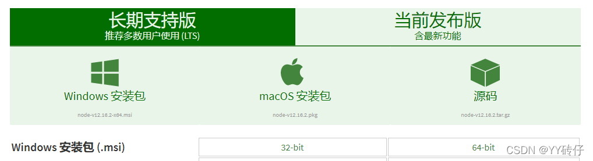

图2-1中有“`Windows`安装包”、“`macOs`安装包”、“源码”三种类型。本书以 `Windows` 系统为基础进行项目的开发，`Node.js` 安装包根据自己的电脑系统下载“32位”或“64位”的文件包，下载后安装便可。

#### 检测安装状态

键盘快捷键“`Win + R`”运行终端，输入“`cmd`”后点击“确定”按钮，如图2-2所示。终端分别输入“`node -v`”、“`npm -v`”指令后按Enter键，如显示了版本号“`v12.16.1`”、“`6.13.4`”，则表示安装成功。

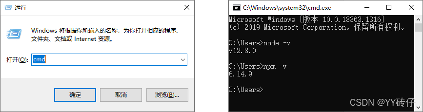

> 未出现版本号，可重启电脑后再次运行终端检测是否安装成功，显示的版本号根据下载的`Node.js`包决定，与本书中的版本号有可能不一致，不影响后续的开发。

### 2.2 开发工具

开发工具是编写代码的软件，市面的软件众多，如 `Dreamweaver`、`VS Code`、`Sublime Text`、`Eclipse`等，工具的使用因人而异，只需自己熟练掌握即可。本书推荐微软出品的`Microsoft Visual Studio Code`（简称 `VS Code`），并且也安装`GIT`代码管理工具，项目开发过程中可结合代码清单的“分支”查看小节所对应的代码。

`Visual Studio Code`：下载地址：https://code.visualstudio.com/。

`GIT`：下载地址：https://git-scm.com/downloads。

### 2.3 脚手架安装

`Vue CLI`是一个基于`Vue.js`进行快速开发的完整系统，提供：搭建交互式的项目、快速开始零配置原型开发、丰富的官方插件集合、完全图形化的创建和管理`Vue.js`项目的用户界面。`Vue CLI`致力于将 `Vue`生态中的工具基础标准化。它确保了各种构建工具能够基于智能的默认配置即可平稳衔接，这样便可以专注在撰写应用上，而不必花好几天去纠结配置的问题。与此同时，它也为每个工具提供了调整配置的灵活性，无需`eject`。
`Vue CLI`脚手架安装也就是安装“工具包”，主流包管理工具有3种：`npm`、`yarn`、`cnpm`，均是在终端使用命令运行：

**`Npm`**

`Npm`资源来源于国外，通常会出现资源加载速度慢、加载失败等情况。
2.1节已经安装了`Node.js`，可直接执行`npm`命令。

● `npm install -g @vue/cli` 使用`npm`命令全局安装`Vue CLI`脚手架；

**`Yarn`**

`Yarn`是`Facebook`发布的一款依赖管理工具，快速、可靠、安全的依赖管理工具，`Yarn`会将每个下载过的包缓存起来，下次依赖时不会重新下载。如果你想使用`yarn`命令，需要先安装`yarn`，请执行以下命令：

● `npm install -g yarn` 全局安装`yarn`；
● `yarn --version` 检查版本号，是否安装成功；
● `yarn global add @vue/cli` 通过`yarn`命令全局安装`Vue CLI`脚手架；

**`cnpm`**

`cnpm`是国内淘宝镜像。构建项目过程中有很多的资源包需要从国外服务器下载，受网络的影响可能会下载失败，因此可使用淘宝镜像下载。目前淘宝镜像的资源包与官方每10分钟同步一次，以保证尽量与官方服务同步，如果你想使用`cnpm`命令，需要先安装`cnpm`，请执行以下命令：

● `npm install -g cnpm --registry=https://registry.npm.taobao.org` 全局安装`cnpm`。
● `cnpm -v` 查看版本号，是否安装成功。
● `cnpm install -g @vue/cli `通过`cnpm`命令全局安装`Vue CLI`脚手架。

**`Vue CLI`脚手版本检测**

`Vue CLI`脚手架安装完成后，需要检查是否安装成功，通过终端执行`vue -V` 或 `vue --version`，如果显示版本号即安装成功，如图2-3所示，如果未显示版本号，可重启电脑后再尝试。

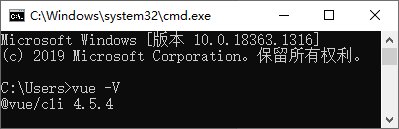

本书的脚手架的版本号是`@vue/cli 4.5.4`。特别要注意是的`Vue CLI`脚手架版本号并不是`Vue.js`版本，笔者微信群很多人误以为脚手架版本号就是`Vue.js`版本号。
了解更多关于 `Vue CLI` 脚手架知识可查看官网：https://cli.vuejs.org/zh/。

### 2.4 项目创建

完成`Vue CLI`的脚手架的安装后便可快速构建一个全新的`Vue.js`项目，可初始化项目的整体结构、依赖包、插件等相关工作。

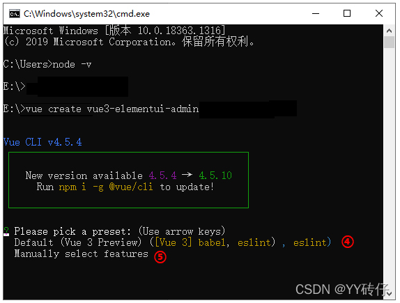

#### 2.4.1 命令构建项目

构建项目肯定是将文件放在电脑的某个硬盘，但不建议把项目放在“C盘”，一般情况下“C盘”是系统盘，如果系统盘出问题，文件基本上很难找回来，除“C盘”之外均可，其他盘均可。由于构建项目的步骤比较多，笔者将构建项目的整体过程做成了一张图片，可在“课件”→“第2章”→“`2-4命令构建项目.jpg`”查看构建的指令。

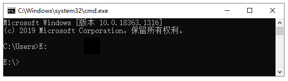

###### 创建项目

终端运行 `vue create vue3-element-plus-admin` 命令来创建一个新项目，`vue create`是固定语法，其中的“`vue3-element-plus-admin`”是自定义的项目名称也是生成的目录名称，按“回车”键后稍等一会便会进入下一步动作。

`Please pick a preset: (Use arrow keys)`：请选择预设类型：（使用箭头选择）；选择“自定义选项安装”并回车。
● `Default (Vue3 Preriew)`：默认，仅安装 `babel`，`eslint`。
● `Manually select features`：自定义选项安装。

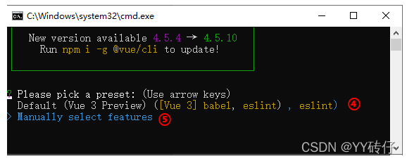

`Check the features needed for your project`：使用“空格”键选择需要的依赖包，“*”号为所需要的依赖；`Vuex` 和 `Router` 是必不可少的依赖包以及 `CSS` 编译器，本书的项目主要以`Javascript`开发项目，如果你熟悉`TypeScript`，可以选择它来开发，选择完成后回车。
● `Babel`：编译，由`ES6` 编译为 `ES5`
● `TypeScript`：`JavaScript`的超集
● `Progressive Web App (PWA) Support`：渐近式`Web`应用
● `Router`：路由
● `Vuex`：状态管理器
● `CSS Pre-processors`：`CSS`预编译器
● `Linter / Formatter`：代码检测及格式化
● `Unit Testing`：单元测试
● `E2E Testing`：端对端测试

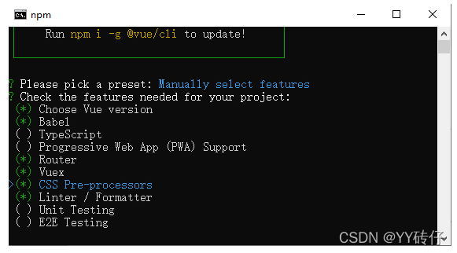

`Choose a version of Vue.js that you want to start the project with？`选择要启动项目的`Vue.js`版本；

本书中所提到的知识点都是`Vue3`的知识点，选择`3.x`便可。

● `2.x`：`Vue2`版本
● `3.x`：`Vue3` 版本

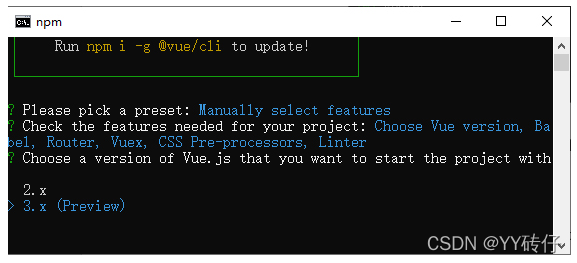

`Use history mode for router? (Requires proper server setup for index fallback in production) (Y/n)`：是否使用“`history`”路由模式？（输入n，并回车，后续路由部分会有详细介绍）

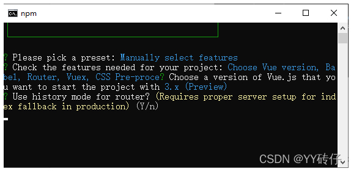

`Pick a CSS pre-processor (PostCSS, Autoprefixer and CSS Modules are supported by default): (Use arrow keys)`：`CSS`编译模式；本书采用`dart-sass`，选择后回车便可。
● `Sass/SCSS (with dart-sass)`：`SASS dart-sass`编译模式
● `Sass/SCSS (with node-sass)` ：`SASS node-sass`编译模式
● `Less`：`less`编译模式
● `Stylus`：`stylus`编译模式

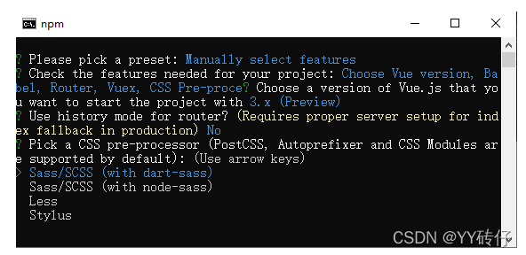

`Pick a linter / formatter config: (Use arrow keys)`：代码规范；选择`ESLint` + `Prettier`回车。
● `ESLint with error prevention only`：仅预防错误
● `ESLint + Airbnb config`：`Airbnb`配置
● `ESLint + Standard config`：标准配置
● `ESLint + Prettier`：格式化形式

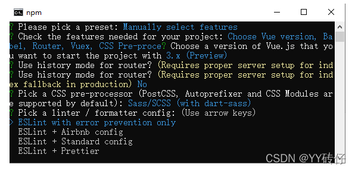

`Pick additional lint features`：代码检测方式；选择Lint on save回车。
● `Lint on save`：保存时检测
● `Lint and fix on commit`：提交时检测

`Where do you prefer placing config for Babel, ESLint, etc.? (Use arrow keys)`：选择项目配置文件的存放方式；选择In dedicated config files回车。
● `In dedicated config files`：单独保存在各自配置文件中
● `In package.json`：保存在`pageage.json`文件中

`Save this as a preset for future projects?` 是否将以上配置进行保存；如果选择了保存，则下次构建项目时可以使用已保存后的配置，无需以现在这样一步步的选择配置。
● `y`：保存（输入存储名称）
● `n`：不保存

`Pick the package manager to use when installing dependencies: (Use arrow keys)`：项目的依赖下载来源；第一次构建项目，可能会出现“项目依赖下载来源”选项。如有出现，选择其一便，本书采用的是 `NPM`。

以上配置完成后便开始构建项目。构建项目需要时间，等待项目构建完成后便会看到“`Sccessfully created project vue3-element-plus-admin`.”表示`vue3-element-plus-admin`项目构建成功，之后可根据指令进入项目并执行 `npm run serve` 指令运行项目。项目运行成功后便会看到的“`Local`”、“`Network`”两个访问项目的地址，复制其一地址到浏览器的“地址栏”便可访问项目。

##### 2.4.2 可视化构建项目

可视化管理是`Vue CLI`新增的功能，可通过面板视图对项目、依赖包、插件等管理，对于不熟悉命令的学者来说会更为方便，可视化构建项目的过程与2.4.1节基本一致。只需在终端运行 `vue ui` 命令便可启动可视化管理界面，笔者同样是将构建项目的整体过程做成了一张图片，可查看“课件”→“第2章”→“`2-5可视化构建项目.jpg`”。

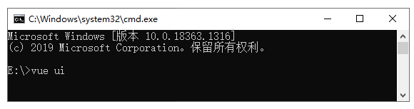

###### 指定目录

可视化构建项目和指令方式构建项目的方式一样，需要将项目放置指定的目录。点击（标记①）处的图标，再到（标记②）输入“E:”回车后切入到E盘，点击“在此创建新项目”按钮开始构建新的项目。

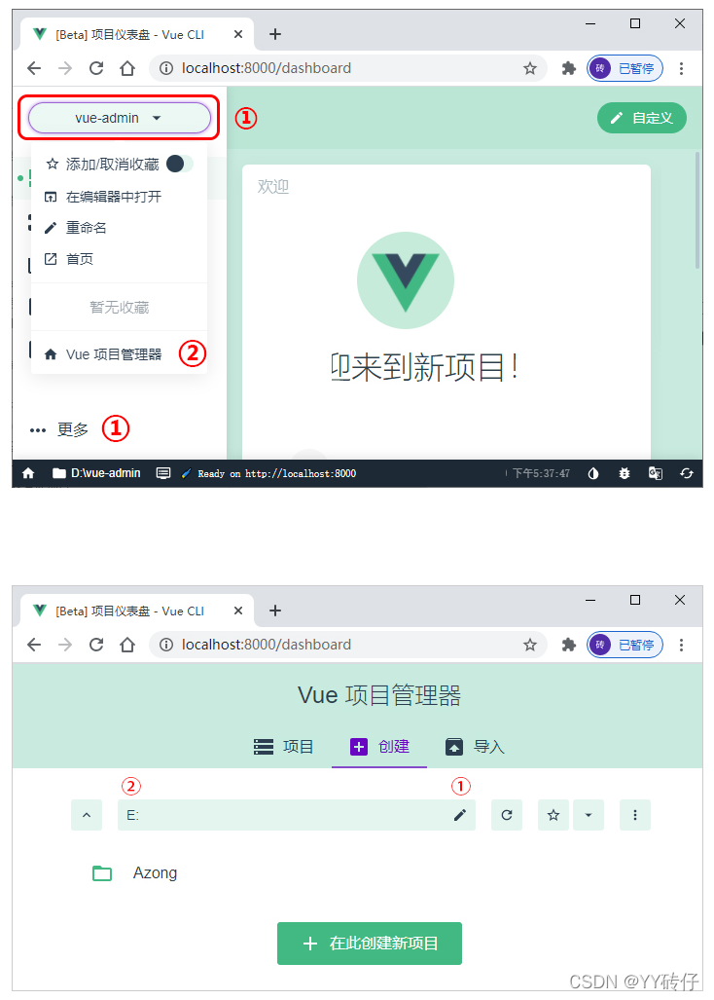

##### 创建项目

点击“在此创建新项目”按钮后便开始构建项目的基本信息，根据下述几点说明进行项目的初始化定义后再点击“下一步”。
① 定义项目名称；
② 修改工作区；
③ 包管理器；（本书选择`npm`）；
④ 自定义的项目名称，在当前工作区如果存在相同文件夹名称，将会覆盖之前的文件；（默认关闭）；
⑤ 引导新手创建项目；（默认关闭）；
⑥ 初始化`GIT`仓库（默认打开），选择关闭；

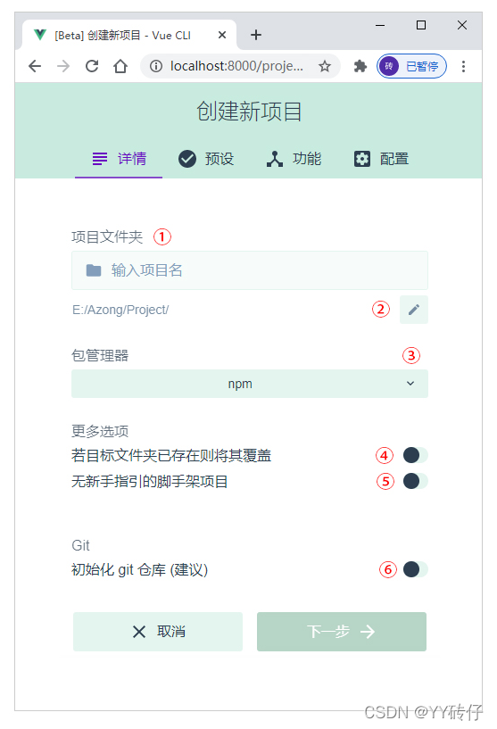

##### 预设

预设的配置和2.4.1节的第3点是一样的，其中的“默认”和“手动”所对应的是 `Default` 和 `Manually select features` 两个选项。如果在2.4.1节的第11点的 `Save this as a preset for future projects?` 做过保存，那么就会显示（标记①）已构建过的项目，否则不会显示，我们依然是选择“手动”配置。

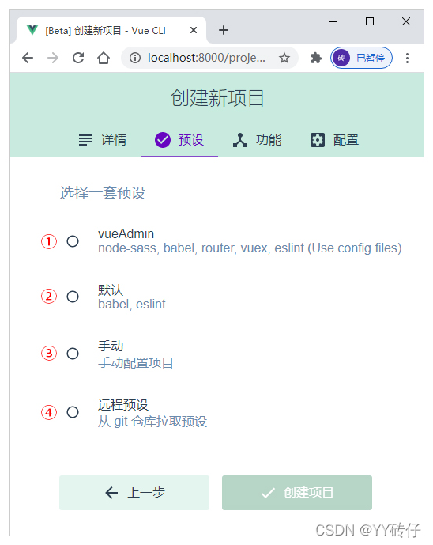

###### 功能

依赖包的配置是构建项目时要选择的功能有什么，和2.4.1节用指令来构建是一样的，只是在可视化面板中是全部集中了在一起方便我们去选择。我们依旧是选择 `Choose Vue version`、`Babel`、`Router`、`Vuex`、`CSS Per-processors`、`Linter` / `Formatter` 以及“使用配置文件”这几项，其中要注意是的“使用配置文件”这个选项的作用是和2.4.1节中的第9点相同。

###### 配置

配置的选项是在选择“功能”时选择了 `CSS Per-processors`、`Linter` / `Formatter` 后需要对这两个选项选择对应的“编译器”和“代码检测规则”，所需配置和2.4.1的第6、7点一致。

###### 保存为新预设

保存预设配置和2.4.1节的第11点相同。可在“预设名”输入框中填写需要存储的名称，如果不想保存，点击“创建项目，不保存预设”按钮便开始创建项目，项目创建过程和2.4.1节的一致，后续就是等待项目构建完成。

### 2.5 项目仓库

项目仓库可以简单的理解为存放代码的地方，项目仓库通常有“本地仓库”和“远程仓库”两种。

本地仓库：指的是电脑硬盘的某个目录，通过`git`工具来管理本地文件信息，`git`会记录文件的历史版本；

远程仓库：由第三方托管的仓库或是公司内部搭建的服务器项目仓库，可通过网址或`IP`访问的仓库；

远程仓库的代码一般会和本地仓库的代码同步，意思就是在本地仓库开发好的项目代码可以推送到远程仓库。

项目开发有多人参与时便会涉及到代码安全性、共享、协作开发、代码管理等问题，也就需要用远程仓库来托管代码，每个人都可以将远程仓库的代码拉取到本地使用`git`工具管理分支代码，完成开发任务后再将代码推送到远程仓库。

工作中较为比较主流的代码托管仓库有“`Gitee`”、“`Coding`”、“`Github`”、“`GitLab`”。 `Gitee`和`Coding`是国内的代码托管服务，个人及企业均可使用。

`Github`和 `GitLab`是国外的代码托管服务，同样也是对个人及企业开放使用，这几种各有各特色，可根据自己的实际情况使用，本书的远程仓库采用的是`Gitee`托管。

`Gitee`官网：https://gitee.com；
`Coding`官网：https://coding.net；
`Github`官网：https://github.com； 
`GitLab`官网：https://gitlab.com/gitlab-com；

#### 2.5.1 申请仓库

申请项目代管仓库以`Gitee`为示例，无论是使用什么样的第三方托管仓库必定需要注册帐号用于管理自己的项目代码，进入`Gitee`首页点击右上角“注册”按钮完成帐号注册。仓库的创建也比较简单，可以根据自己的项目情况创建“公开”或“私有”仓库，并且没有限定仓库的创建数量，如图2-4所示。

管理面板右上角的“+”号是下拉菜单，点击“新建仓库”进入图2-4右侧“新建仓库”页面，该页面创建仓库信息如下：
仓库名称：尽量采用“字母”命名，该仓库名称也可视为是项目的名称（必填项）；

● 路径：访问仓库的`Url`地址，默认由“仓库名称”自动生成，也可自定义；

● 仓库介绍：对仓库的简要描述（非必填）；

● 仓库可见性：“开源”是任何人都可根据仓库名称或仓库的`Url`地址找到该仓库，“私有”只有自己和被邀请者可见；

● 复选项：“初始化仓库”、“设置模板”、“选择分支模型”三个选项根据自己的需要选择便可，但比较重点的两个文件是“设置模板”→“`Readme`”和“初始化仓库”→“`.gitignore`”，前者是“描述文件”，后者是“忽略文件”。

`Readme.md`选项可以不勾选，因为在使用`Vue CLI` 脚手架创建项目时已经生成了该文件；`.gitignore`文件可以忽略项目指定的文件无需纳入`git`的管理。

项目中并不是所有的文件都要纳入到git版本库中管理，如项目的`node_modules`依赖包文件夹，依赖包会有几十上百兆的大小，这些依赖包是可以使用指令`npm install`重新依赖的，也就没有必要提交到`git`仓库，在`.gitignore`添加文件夹或文件名便可忽略提交，如图2-5所示；

#### 2.5.2 推送项目

推送项目是将本地环境的项目文件推送到远程仓库，可让其他开发人员拉取项目代码共同完成项目的开发。图2-6是创建仓库后未提交代码的状态，也提示了如何使用`git`创建“本地仓库”初始化本地项目的代码。

图2-6的（标记①、②）分别是“`HTTPS`”和“`SSH`”两种协议仓库地址，两者都可以使用`git clone`命令拷贝仓库，区别在于前者首次“拉取”或“推送”代码时都需要输处帐号密码，后者在配置“`ssh公钥`”后每次“拉取”或“推送”时不需要输入密码，我们将采用`HTTPS`协议来初始化项目代码并推送。

图2-6“创建`git`仓库”的 `mkdir` 和 `cd` 命令是“创建目录”及“进入”目录命令（标记③、④），但我们已经完成了项目的构建，可直接进入已构建好的项目 `vue3-element-plus-admin` 目录，无须执行 mkdir 和 cd。

初始化 `git init`
`git init` 命令是在项目里生成 `.git` 文件夹，但在使用 `Vue CLI` 脚手架构建项目时已经生成了 `.git `文件夹，可以先将 `vue3-element-plus-admin` 项目的 `.git` 文件夹删除，然后在项目根目录点击鼠标右键选择“`Git Base Here`”菜单选项并在弹出的窗口中输入 `git init `命令并回车来重新生成 `.git` 文件夹。

添加文件 `git add` .
`git add` 命令是将指定的文件添加到暂存区，图2-6（标记⑥、⑦）的命令是“创建`README.md`”和“添加`README.md`”文件，但是在构建项目时已经生成了该文件，同时也生成了整个项目的基础文件，要做的是将项目的所有文件都添加到暂存区，只有被添加到的暂存区的文件才能被推送到远程仓库，因此可以跳过（标记⑥、⑦）的命令，直接执行“`git add .`”，注意的是`add`后面是一个“点”，整体理解为“将所有变化的文件提交到暂存区，包括修改过内容的文件以及新增的文件”，执行`git add .`后便会把所有文件添加到暂存区。

提交 `git commit`
`git commit` 命令是提交暂存区的版本，每次变更文件后执行 `git commit` 都会产生一个版本。图2-6（标记⑧）的命令中带有“-m”参数，该参数可以在提交版本时写入此次提交版本的描述，可以让其他协作人员知道此次提交的版本做了哪些更改。

建立连接
建立连接是将本地仓库和远程仓库进行连接，建立后就可以将项目代码推送到远程仓库，直接复制图2-6（标记⑨）的命令直接在 git 上运行便可。

文件推送
建立连接后便可将项目文件推送到远程仓库。直接复制图2-6（标记⑩）的指令 `git push -u origin master`便会提示输入“用户名”和“密码”，因为我们选择的是`HTTPS`协议初始化本地仓库，因此需要输入`Gitee`官网注册的帐号和密码，“确定”后便会开始推送代码并创建 master 主分支，推送完成后刷新 `Gitee` 仓库便会看到和本地的项目文件基本一致，但又有一部分文件并不在远程仓库，这是因为`.gitignore`文件忽略了指定的文件，也就不会被推送到远程仓库。

#### 2.6 项目分支
分支在团队多人协作开发中起着至关重要的作用，无论是个人代码、项目的迭代都可以很好的对代码起到保护、维护、修复等作用。分支可以理解为像“树”一样的结构体，可以从主体分离出来很多枝杆，又不影响主体，枝杆各作各的事互不影响，枝杆的工作完成后再合并到主体，再将分离出来的枝杆删除，这样就起到了保护作用、互不干扰。

##### 2.6.1 分支命名
分支命名是为了规范开发，保持代码提交记录以及`git`分支结构清晰，方便后续维护。`git`分支常规性可分为主分支、开发分支、功能分支、修复分支、测试分支等，不同的分支其作用也不同，如下类型：

`Master`主分支：用于发布生产环境的版本分支。项目达到上线标准后，运维人员会在`master`建立标签Tags版本号，将该版本号部署生产环境；

`Release`测试分支：该分支基于`Master`分支建立的子分支，作用于项目测试使用的分支，测试通过达到上线标准将该分支合并至`Master`分支。

`Develop`开发分支：该分支基于`Master`分支建立的子分支，作用于开发人员所有需求的合并，完成所有需求开发后合并到`Release`分支，提交到测试服务器测试。

`Feature`需求分支：该分支基本`Develop`分支建立的子分支，也称为功能分支。根据不同的需求建立多个`Feature`分支，完成功能开发后合并到`Develop`分支。

`Bug`问题分支：该分支基于`Release`分支建立的子分支，作用于修复测试环境的问题，修复完成后合并到`Release`和`Develop`两个分支，使修复的问题同步。

`Hotfix`紧急分支：该分支基于`Master`分支建立的子分支，作用于生产环境问题的紧急修复，修复完成后合并到`Master`和`Develop`分支。

了解了分支类型后来看看分支的结构以及分支命名的规范，如图2-7所示。

理解分支
图2-7中的分支结构是上述所提到的“树”形结构，`develop`分支中有`feature-user-v1.0`、`feature-pay-v1.0`、`feature-order-v1.0`三个分支，分别代表“`用户需求`”、“`支付需求`”、“`订单需求`”。分支的整体含义如下所示：`feature-user-v1.0`

● `feature`：分支类型（需求）

● `user`：模块名称（用户模块）

● `v1.0`：项目版本号（当前需求版本号）

上述的整体理解为：用户功能模块v1.0版本。当然了，也并非一定是这种理解方式，也可以是“1.0版本的用户功能模块”，只要能描述清楚分支的作用就可以。

问题分支
hotfix分支和bug分支均属于问题，前者是生产环境的紧急问题，后者是测试环境的测试问题。图2-7的`hotfix`和`bug`分支都带有编号，这个编号是测试工程师在“`Bug`面板”提交问题时自动生成的，如图2-8所示。

图2-8是“禅道”项目管理软件的“`Bug`”栏，第一列的“ID”是编号，建立 `hotfix` 或 `bug` 分支时所带的编号，这样就可以很明确的知道分支处理的问题是什么，只要找到对应的编号便可得知分支修复的问题是什么。

禅道官网演示：http://zentaomax.demo.zentao.net/bug-browse-6.html。禅道管理项目是其中一种方式，也可以使用其他的项目管理工具。以上分支管理方式仅供参考，并非所有公司对仓库分支管理都是如此。

##### 2.6.2 分支管理
工作中大多数公司的开发团队均会采用Git来做代码版本控制，相比同类型的软件来说，Git的优点有很多，其中比较显著的一点是版本分支的控制和分支合并比较方便。分支的管理可以有效的协同开发人员之间的配合，分支之间互不干扰，各自开发各自的需求和内容，最后再合并到主分支，但每个人的工作方式不同对Git分支管理的方式也会所有不同，下面介绍一下常规性的分支管理规范，如图2-9所示。

图2-9可以看到有很多的“圆点”和“箭头”的流向，圆点：是分支每次在执行`commit`命令时产生的“暂存区的文件”，箭头：是创建分支和合并分支的流向。

主分支
`master`主分支作用于线上环境的代码部署。图中可以看到master分支有V1.0、V2.0、V3.0、V4.0版本号。这些版本号是可以自由创建的，部署线上环境代码时都要创建版本号，其一是为了记录当前发布的版本包含了哪些功能需求；其二是可以切换到指定版本号部署代码；master分支是项目最新版本的稳定分支，不要在该分支修改任何代码。

开发分支
`develop`是开发分支，作用于开发人员的开发环境。图中的`master`箭头指向`develop`分支，也就是在`master`分支上执行 `git branch develop `命令创建 `develop` 分支。

需求分支
需求分支是`feature`，图中可以看到有2个`feature`，也就是有2个需求，都是从`develop`分支创建出来的。如果需求的开发周期较长时，可以每次开发完一部分后执行commit命令暂存文件，也就会看到`feature`分支上面的圆点有多有少的情况，完成需求的开发后再合并到`develop`分支。

测试分支
测试分支是`release`，作用于对项目的验收和问题修复，该分支从`develop`分支创建。项目在指定日期提测时，需要将develop分支合并到release分支，因为develop已经包含了所有的功能需求，所以在测试环境直接部署`release`分支的代码。

问题分支
问题分支也就是我们经常说到的`bug`，也是测试工程时在测试环境测到的问题。遇到了问题就要在`release`分支创建`bug`分支，根据“`bug`”面板的编号创建。每次解决bug后，需要合并回`release`分支和`develop`分支，使修复的bug同步，然后删除bug分支。

紧急问题分支
紧急问题分支是`hotfix`，也就是线上环境遇到的问题。线上环境是正在运行的项目，必须从`master`分支创建`hotfix`类型分支修改问题，问题修复完成后再合并回`master`，此时发布线上环境就要再创建一个版本号进行线上环境的代码部署，同时将修复的问题合并到`develop`分支。如果需要在测试环境验收问题也可以合并到`release`分支，然后再删除`hotfix`分支。
上述几点是分支类型的应用过程，如果没有特殊要求的情况基本上可以满足日常开发过程中对分支的管理。下面了解一下常用的Git对分支操作的命令，如表2-2所示。

如表2-2所示

命令行	描述

`git clone <仓库地址>`	拷贝项目
`git branch`	创建分支
`git checkout -b`	建并进入分支
`git status`	查看状态
`git add .`	添加所有已变更的文件
`git commit -m “描述”`	提交暂存区，可对此次提交的内容进行说明
`git pull`	拉取远程仓库代码
`git push`	推送代码至远程仓库
`git branch --list`	查看本地分支
`git branch -a`	查看本地以及远程仓库分支
`git merge --no-ff -m “描述”`	合并指定分支到当前分支，可对合并的内容描述

#### 2.6.3 分支创建
2.5.2节已经完成了项目推送至远程仓库，但本地仓库所处的分支还是master。根据2.6.2节的知识点，我们应该在develop分支下开发项目，因此根据表2-2的命令行在master分支创建develop分支，如图2-10所示。

图2-10左侧执行了git checkout -b develop创建并进入develop分支，然后执行git push，此时会提示git push --set-upstream origin develop，这是因为新创建出来的分支在远程仓库并不存在的，要做的就是将这段命令执行一次就可以，意思就是将develop分支推送至远程仓库并以本地分支进行关联，推送至远程仓库后其他协同的开发者也就可以拉取到自己的代码。

develop是开发分支，但实际开发项目需求时会在属于该需求的feature类型分支上开发，也就是要在develop分支下创建feature类型的分支。如图2-10右侧创建的feature-config分支，这个分支也就是下一章要讲解到的“项目配置”的内容，也是属于独立的需求，创建完成后也是用同样的方式将feature-config分支推送至远程仓库，之后便是在该分支上开发“项目配置”业务需求，待开发完成后便要将当前分支的代码合并到develop分支，也就是3.6.6节的“分支合并”。

分支的代码推送并不一定要待到业务需求开发完成后再推送，可以开发完一部分推送一部分也是没有问题的。每次推送都会产生一个节点，就和图2-9类型的“圆点”代表一次暂存或推送。

### 小结

了解并使用Vue CLI脚手架构建项目，并为项目创建远程仓库。项目的代码版本管理在团队协作开发中是非常重要的一个过程，版本的管理很好的解决同事与同事之间产生的代码冲突、互改文件、隔离、版本控制等问题，有效的提高项目的质量和开发效率。
项目的构建以及远程仓库的结合，可以很好的解决多人团队的共同开发、协作、代码维护等需求及项目分支管理和项目测试、部署等问题。

## 第3章 初始项目

俗说话“知已知彼方能百战不败”。我们在开发项目时也是相同道理，需要把项目整体结构、业务逻辑、交互等需求以及所需要的基本配置理解清楚了，才能更好更稳的开发项目。

### 3.1 启动项目

开发项目的工具在2.2节中推荐使用VS Code，要做的事就是将项目添加到VS Code工作区，通过VS Code的终端运行项目。VS Code菜单栏选择“文件”→“将文件夹添加到工作区”选项，选择已完成构建的项目名称vue3-element-plus-admin，点击“添加”按钮，VS Code左侧工作区便可看到项目的整体目录，如图3-1所示。

（标记①）所处位置是终端，按“CTRL + ~”键可对“终端”进行显示或隐藏；（标记②）是项目的路径地址，在指定项目下运行 npm run serve 指令便可启动项目；如果你想运行其他的项目，只需点击（标记③）处的“+”号按钮，在（标记④）位置弹出的项目名称中选择项目，再回到终端运行便可。

### 3.2 项目结构

项目结构是项目的整体展现，也是对不同文件以及文件夹的类型归整。项目在开发的过程中会随着业务需求的增加，会不断的增加新的文件或文件夹，只有将文件和文件夹进行不同的业务类型划分管理才能更好的开发及维护项目，同时也能够体现出项目的质量程度。无论是什么项目，作为开发人员务必要了解项目的整体结构以及文件、文件夹的具体作用，只有这样才能更好的将项目进行到底，如图3-2所示。

图3-2是项目整体文件的分布结构，其中重点要关注的是 package.json、main.js、App.vue、src文件夹以及public 文件夹，这几个重点的文件我们会在后面的章节中了解它们的作用，现在先来了解一下其他的文件。

README.md
README.md是描述文件，相当于说明文档。可以对当前项目做一些相关的介绍，采用的是Markdown语言编写。

.browserslistrc
使用Vue CLI 脚手架搭建项目时自动生成的.browserslistrc文件，该文件主要是配置浏览器兼容，配置参数如表3-1所示。

表3-1 .browserslistrc 部分配置参数做一些解释

语法	描述
>1%	代表着全球超过1%人使用的浏览器
>last 2 versions	表示所有浏览器兼容到最后两个版本
>not ie <=8	表示IE浏览器版本大于8
>safari >=7	表示safari浏览器版本大于等于7
>.eslintrc.js
>Eslint配置文件主要是检测代码合法性。其次是按照eslint配置文件的规范格式化代码，Eslint文件可根据官方文档定义代码规则。
>● 英文文档：https://eslint.org/docs/user-guide/configuring/
>● 中文文档：http://eslint.cn/docs/rules/

babel.config.js
babel.config.js是插件和预设的集合。例如在引用第三方UI或第三方插件时均可在该文件中配置（3.6.4节），只需根据第三方的规则配置便可。有一点很重要的是babel.config.js会影响整个项目中的代码，包含node_modules中的代码，自定义配置时务必注意是否会影响全局代码。

.gitignore
.gitignore配置Git忽略文件，该文件的作用是告诉Git有哪些文件不需要添加到版本管理。例如项目中的 node_modules 包文件夹，这个文件夹会占用很大的内存，一般是不会提交到的远程仓库，只需将该文件夹路径添加到 .gitignore 文件中，提交代码时便会忽略该文件夹（2.5.1节）。

node_modules
node_modules是存放当前项目所需要的各种依赖包，例如：vue、asiox、js-cookies等等。构建项目时已经完成了包的依赖，会自动生成node_modules文件夹，没有该文件项目就无法运行，可以使用 npm install 指令重新安装 package.jsn 文件中的依赖包。

package.json
package.json 是模块描述文件，使用Vue CLI脚手架构建项目后会自动生成该文件以及基础的模块信息，如图3-3所示。

package.json 文件有“生产环境”、“开发环境”、“脚本命令”等几块内容。生产环境对应的是 dependencies、开发环境对应的是 devDependencies、脚本命令对应的是scripts。

dependencies 和 devDependencies 两个环境在安装依赖包时要弄清楚是当前依赖的包的作用是什么，根据实际作用选择依赖到“生产环境”还是“开发环境”。（3.6.5节详细介绍）

scripts 对象是脚本命令，也就是在终端运行的指令。例如运行的是 npm run serve 对应的便是 scripts 下的 serve，如果运行的是 npm run build 对应的便是 scripts 下的 build，其他的指令也是一致的，只需要更改 npm run 指令后面的“key”。

name 和 version 是名称及版本号，值为字符串。

### 3.3 文件结构
### 3.4 项目入口
### 3.5 路由
### 3.5 路由
### 3.5 路由
### 3.6 项目初始化配置
## 第4章 Vue3的变化
## 第5章 登录注册业务需求
## 第6章 管理后台搭建
## 第7章 VUEX状态管理
## 第8章 路由守卫
## 第9章 信息管理模块
## 第10章 组件化
## 第11章 系统配置
## 第12章 权限功能
## 第13章 项目部署
